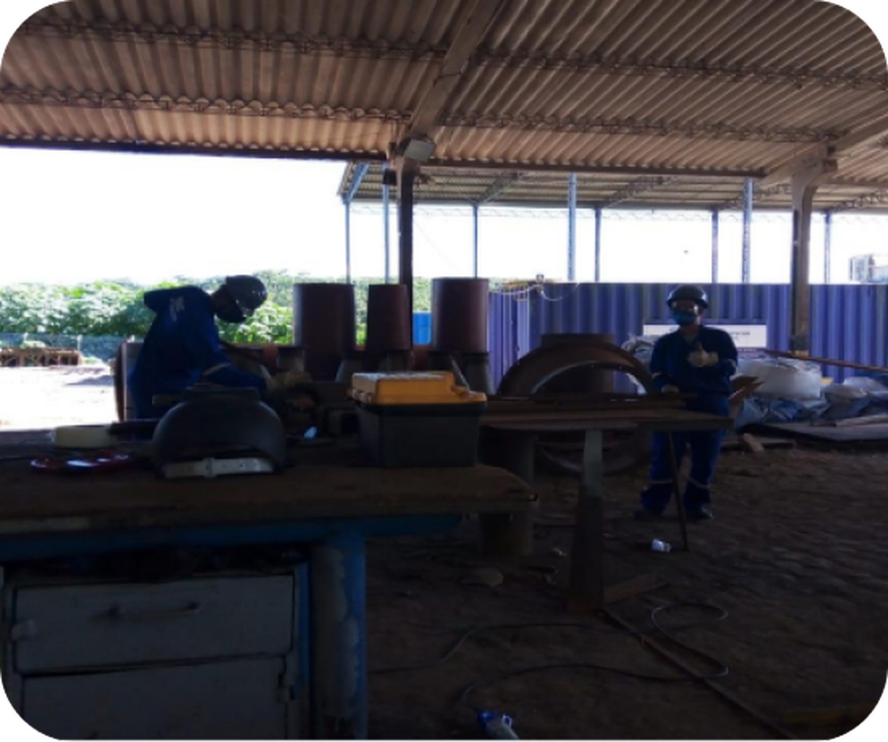

# Index.HTML

O código HTML a seguir define a estrutura de uma página web para a empresa Remast Consultoria em Gestão Empresarial. A página é composta por várias seções, cada uma com uma função específica, e inclui links para estilos e scripts externos para melhorar a aparência e a funcionalidade.

# Cabeçalho (`<head>`)

### Metadados e Configurações Básicas

~~~html
<meta charset="UTF-8" />
<meta http-equiv="X-UA-Compatible" content="IE=edge" />
<meta name="viewport" content="width=device-width, initial-scale=1.0" />
~~~

- **charset="UTF-8"**: Define a codificação de caracteres como UTF-8.
- **http-equiv="X-UA-Compatible" content="IE=edge"**: Garante compatibilidade com diferentes versões do Internet Explorer.
- **name="viewport" content="width=device-width, initial-scale=1.0"**: Configura a página para ser responsiva, ajustando-se a diferentes tamanhos de tela.

### Título e Links para Recursos Externos

~~~html
<title>Remast</title>
<link rel="stylesheet" href="css/style.css" />
<link rel="icon" href="assets/logo/favicon/favicon-16x16.png" type="image/x-icon">
<link rel="stylesheet" href="https://cdnjs.cloudflare.com/ajax/libs/animate.css/4.1.1/animate.min.css">
<link rel="stylesheet" href="https://cdnjs.cloudflare.com/ajax/libs/aos/2.3.4/aos.css">
~~~

- **title**: Define o título da página.
- **link rel="stylesheet" href="css/style.css"**: Link para o arquivo CSS de estilos.
- **link rel="icon" href="assets/logo/favicon/favicon-16x16.png" type="image/x-icon"**: Define o favicon da página.
- **link rel="stylesheet" href="https://cdnjs.cloudflare.com/ajax/libs/animate.css/4.1.1/animate.min.css"**: Inclui a biblioteca Animate.css para animações.
- **link rel="stylesheet" href="https://cdnjs.cloudflare.com/ajax/libs/aos/2.3.4/aos.css"**: Inclui a biblioteca AOS para animações de rolagem.

# Corpo (`<body>`)

## Cabeçalho e Navegação (`<header>`)

~~~html
<header>
  <nav class="nav">
    

      
      <a class="logo-text" href="/">Remast Consultoria</a>
    

    

      

      

      

    

    <ul class="nav-list">
      <li><a class="nav-link" href="#banner">HOME</a></li>
      <li><a class="nav-link" href="#who-we-are">QUEM SOMOS</a></li>
      <li><a class="nav-link" href="#our-services">NOSSOS SERVIÇOS</a></li>
      <li><a class="nav-link" href="#how-we-do">COMO FAZEMOS</a></li>
      <li><a class="nav-link" href="#contact">CONTATO</a></li>
    </ul>
  </nav>
</header>
~~~

- **nav**: Barra de navegação contendo o logotipo e os links para diferentes seções da página.
- **div class="logo"**: Contém o logotipo e o texto da logo.
- **div class="mobile-menu"**: Menu para dispositivos móveis com linhas que representam o ícone de menu.
- **ul class="nav-list"**: Lista de navegação com links para seções da página.

## Seções da Página (`<section>`)

## Banner

~~~html
<section class="banner" id="banner">
  
Transforme desafios em oportunidades com a Remast Consultoria em Gestão Empresarial. Consulte-nos e impulsione seu negócio

</section>
~~~

- **section class="banner" id="banner"**: Seção do banner principal com uma mensagem promocional.

## Quem Somos

~~~html
<section class="section" id="who-we-are">
  <h1 class="title">Remast Consultoria em Gestão Empresarial</h1>
  

    

      Somos uma empresa jovem e inovadora localizada em Dias D'Ávila-BA, comprometida em oferecer soluções inteligentes e econômicas para gestão empresarial. Desde 2015, ajudamos nossos clientes a crescerem de forma consciente e integrada, promovendo mudanças positivas em seus negócios.
    

    
  

</section>
~~~

- **section class="section" id="who-we-are"**: Seção que apresenta a empresa.
- **h1 class="title"**: Título da seção.
- **div class="double-column"**: Contém o texto descritivo e uma imagem.

### Animações AOS

- **data-aos="fade-right"**: Aplica uma animação de desvanecimento da direita.
- **data-aos="fade-left"**: Aplica uma animação de desvanecimento da esquerda.
- **data-aos-duration="1000"**: Define a duração da animação como 1000 milissegundos (1 segundo).

## Nossos Serviços

~~~html
<section class="section" id="our-services" data-aos="fade-up" data-aos-duration="1000">
  <h5 class="title">Nossos Serviços</h5>
  

    

      
      

        <h6 class="card-title">Consultoria em Gestão</h6>
        

          Oferecemos serviços de consultoria em gestão empresarial, ajudando nossos clientes a alcançarem seus objetivos e superarem desafios.
        

      

    

    <!-- Outras cartas de serviços -->
  

</section>
~~~

- **section class="section" id="our-services"**: Seção que descreve os serviços oferecidos pela empresa.
- **h5 class="title"**: Título da seção.
- **div class="card-group"**: Grupo de cartões que descrevem cada serviço.

### Animações AOS

- **data-aos="fade-up"**: Aplica uma animação de desvanecimento de baixo para cima.
- **data-aos-duration="1000"**: Define a duração da animação como 1000 milissegundos (1 segundo).

## Por Que Contratar uma Consultoria?

~~~html
<section class="section" id="consultancy">
  <h5 class="title">Por Que Contratar uma Consultoria?</h5>
  

    

      A consultoria empresarial se fortalece como uma forma de imprimir agilidade aos negócios e promover mudanças difíceis de serem executadas internamente. Contrate a Remast e garanta vantagem competitiva para sua empresa.
    

    
  

</section>
~~~

- **section class="section" id="consultancy"**: Seção que explica os benefícios de contratar uma consultoria.
- **h5 class="title"**: Título da seção.
- **div class="double-column"**: Contém o texto explicativo e uma imagem.

### Animações AOS

- **data-aos="fade-right"**: Aplica uma animação de desvanecimento da direita.
- **data-aos="fade-left"**: Aplica uma animação de desvanecimento da esquerda.
- **data-aos-duration="1000"**: Define a duração da animação como 1000 milissegundos (1 segundo).

## Como Fazemos

~~~html
<section class="section" id="how-we-do">
  <h5 class="title">Como Fazemos</h5>
  

    

      Na Remast, nosso método de trabalho é pautado pela excelência e eficiência. Seguimos um processo cuidadoso em cada etapa, garantindo resultados superiores e satisfação total de nossos clientes. Veja como trabalhamos:
    

    

      

        1. Análise Detalhada: Iniciamos com uma análise minuciosa das necessidades e características específicas de cada cliente.
      

      <!-- Outros passos do processo -->
    

  

</section>
~~~

- **section class="section" id="how-we-do"

**: Seção que descreve o método de trabalho da empresa.
- **h5 class="title"**: Título da seção.
- **div class="double-column"**: Contém o texto descritivo e os passos do processo.

### Animações AOS

- **data-aos="fade-right"**: Aplica uma animação de desvanecimento da direita.
- **data-aos="fade-left"**: Aplica uma animação de desvanecimento da esquerda.
- **data-aos-duration="1000"**: Define a duração da animação como 1000 milissegundos (1 segundo).

## Contato

~~~html
<section class="section" id="contact">
  <h5 class="title">Contato</h5>
  

    <iframe class="map" src="https://www.google.com/maps/embed?pb=!1m18!1m12!1m3!1d124592.48040901417!2d-38.35240127911593!3d-12.61418279524615!2m3!1f0!2f0!3f0!3m2!1i1024!2i768!4f13.1!3m3!1m2!1s0x7165dbb3e1f8537%3A0x55ba6ca88357f71a!2sDias%20d&#39;%C3%81vila%20-%20BA%2C%2042850-000!5e0!3m2!1spt-BR!2sbr!4v1715083342589!5m2!1spt-BR!2sbr" allowfullscreen="" loading="lazy" referrerpolicy="no-referrer-when-downgrade"></iframe>
  

  

    

      

        
        

          <h5 class="card-title">Localização</h5>
          
42850-000 Dias D'Ávila - Bahia/Brasil

        

      

      

        
        

          <h5 class="card-title">Whatsapp</h5>
          
+55 (71) 9 9288-7866

        

      

      

        
        

          <h5 class="card-title">Email</h5>
          
remast@remast.com.br

        

      

      

        
        

          <h5 class="card-title">Horário de Atendimento</h5>
          
Segunda a sexta de 08:00 às 17:00

        

      

    

  

</section>
~~~

- **section class="section" id="contact"**: Seção de contato contendo informações de localização, WhatsApp, email e horário de atendimento.
- **h5 class="title"**: Título da seção.
- **div class="map-container"**: Contém um iframe com o mapa de localização.
- **div class="group-contact-information"**: Grupo de cartões com informações de contato.

### Animações AOS

- **data-aos="fade-up"**: Aplica uma animação de desvanecimento de baixo para cima.
- **data-aos-duration="1000"**: Define a duração da animação como 1000 milissegundos (1 segundo).
- **data-aos-duration="2000"**: Define a duração da animação como 2000 milissegundos (2 segundos).

## Rodapé (`<footer>`)

~~~html
<footer class="footer">
  

    © 2023 - Todos os direitos reservados - Remast Consultoria em Gestão Empresarial
  

  

    Portal Conexão Azul Digital Ltda - conexaoazul.com
  

</footer>
~~~

- **footer class="footer"**: Rodapé contendo informações de direitos autorais.

# JavaScript (`

~~~

- **script src="js/scripts.js"**: Inclui um arquivo JavaScript externo para funcionalidades adicionais.
- **script src="https://cdnjs.cloudflare.com/ajax/libs/aos/2.3.4/aos.js"**: Inclui a biblioteca AOS para animações de rolagem.
- **AOS.init()**: Inicializa as animações da biblioteca AOS.

## Resumo das Bibliotecas de Animação

- **Animate.css**: Utilizada para animações gerais na página, como desvanecimento, deslizamento, etc.
- **AOS (Animate On Scroll)**: Utilizada para aplicar animações quando os elementos entram na visualização durante a rolagem da página. 
  - **data-aos**: Define o tipo de animação (ex. `fade-right`, `fade-left`, `fade-up`).
  - **data-aos-duration**: Define a duração da animação em milissegundos.

> Este código cria uma página web completa com uma estrutura bem definida, seções claras para diferentes tipos de conteúdo, e estilos e scripts externos para aparência e funcionalidade aprimoradas, incluindo animações interativas e responsivas.